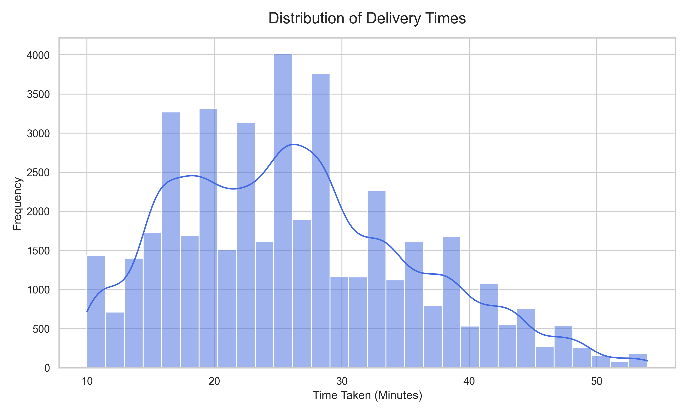
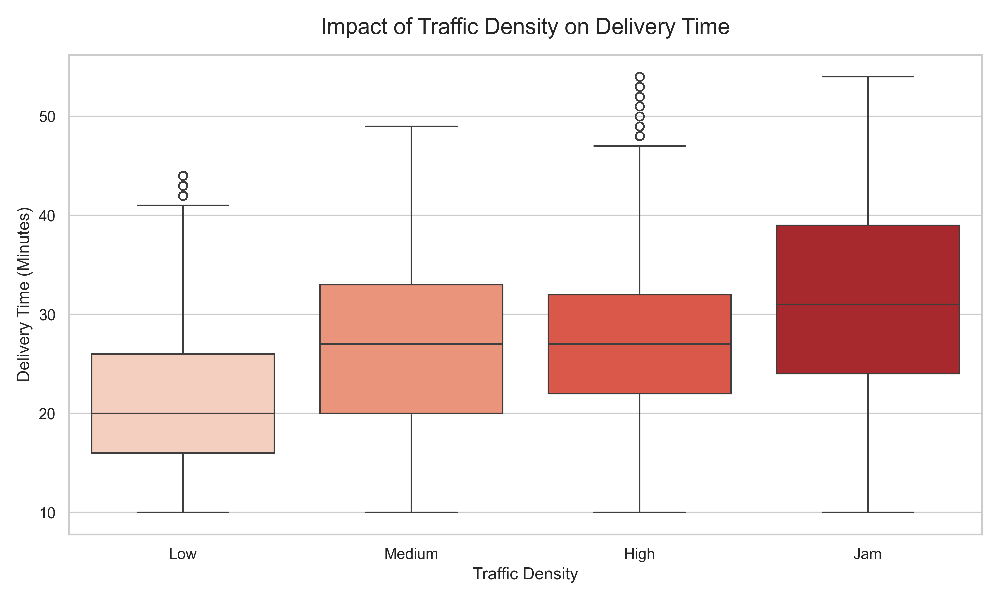
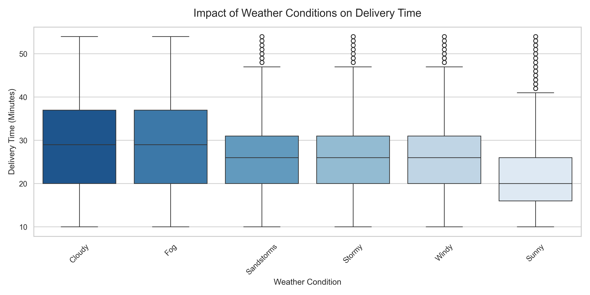
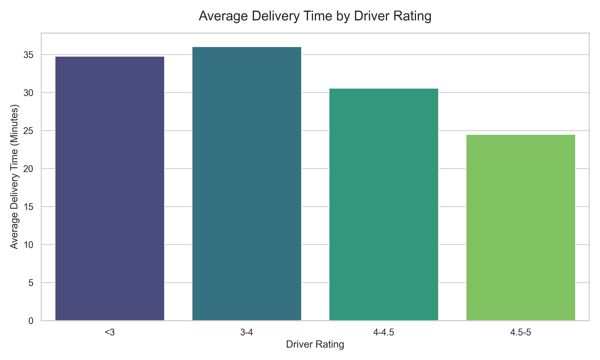
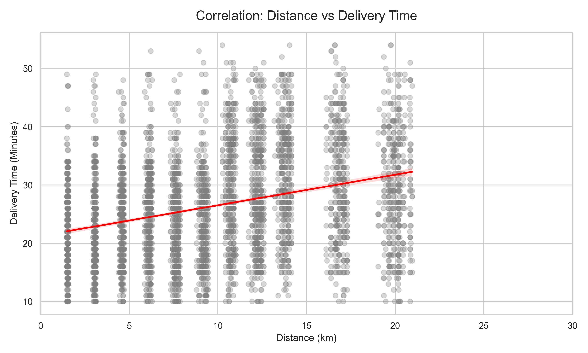
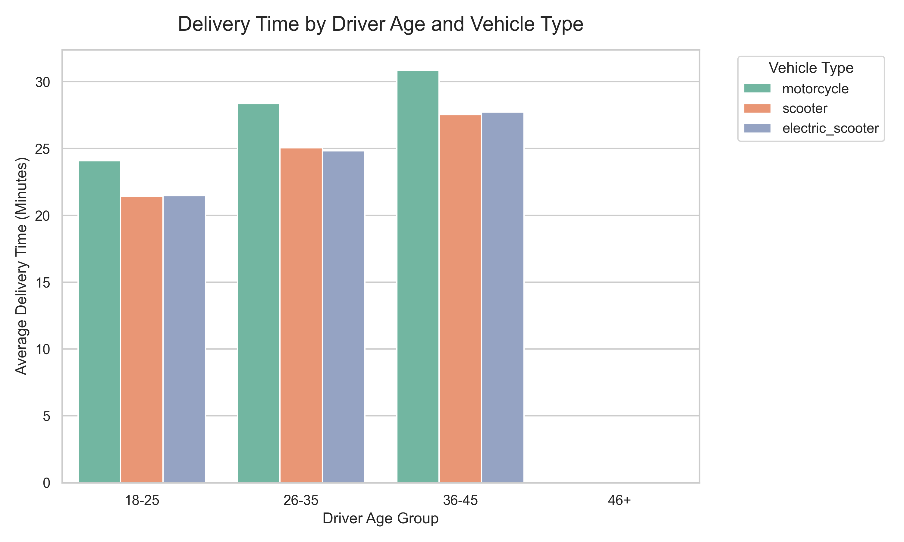

# 🛵 Zomato Delivery Operations: Exploratory Data Analysis (EDA)

## 📌 Executive Summary

This project performs an end-to-end Exploratory Data Analysis (EDA) on a real-world Zomato logistics dataset containing over 45,000 delivery records. The objective of this project is to uncover operational bottlenecks and mathematically quantify how factors like weather, traffic density, delivery distance, and driver demographics impact the Estimated Time of Arrival (ETA).

## 🎯 Key Insights

Through data cleaning, feature engineering (Haversine distance calculation), and statistical visualisation, the following operational insights were discovered:

1. **Baseline ETA & The "Long Tail":** While the majority of deliveries are completed between 20 and 30 minutes, the distribution is heavily right-skewed, revealing a persistent problem of extreme operational delays (50+ minutes).
2. **Traffic is the Ultimate Bottleneck:** Deliveries in "Jam" traffic conditions take significantly longer (a median of 31 mins) compared to "Low" traffic conditions (median of 21 mins).
3. **Weather Causes ETA Variance:** "Fog" and "Cloudy" conditions cause the highest delays, whereas "Sunny" weather results in the fastest and most predictable ETAs.
4. **The Physics of Delivery:** There is a direct positive correlation between geographic distance and delivery time. However, massive outliers exist where short distances (<5km) took >40 minutes, pointing to severe restaurant-side preparation delays.
5. **Fleet Optimization (Ratings, Age & Vehicle):** Operational efficiency drops significantly under three conditions: when a driver's rating falls below 3.0, when motorcycles are used instead of scooters, or when the oldest demographic (46+) is assigned to bicycles.

## 📂 Project Structure

This project strictly follows professional Data Science directory standards:

```text
zomato-delivery-eda/
├── data/
│   ├── processed/         # Cleaned and engineered dataset
│   └── raw/               # Original Kaggle CSV
├── figures/               # 6 exported visualisations
├── notebooks/
│   └── 01-eda.ipynb       # Initial exploration, sandbox, and imputation testing
├── src/
│   ├── data_cleaning.py   # Python module for handling nulls & Haversine distance
│   └── visualisation.py   # Python module to generate standard charts
├── requirements.txt       # Project dependencies
└── README.md              # Project documentation
```

## 📊 Visualisations Included

The `figures/` directory contains the following exported charts detailing the operational insights:

### 1. Baseline Delivery Time Distribution

_The overall distribution of delivery times across all 45,000+ orders, establishing the baseline ETA._


### 2. The Bottleneck: Traffic Density vs. Delivery Time

_Deliveries in "Jam" traffic take significantly longer, creating the largest operational bottleneck._


### 3. The Environment: Weather Impact

_Foggy and Cloudy conditions result in the highest median delivery times and widest variance._


### 4. Driver Performance: Ratings vs. Delivery Time

_There is a stark contrast in delivery speed between the highest and lowest-rated delivery partners._


### 5. The Physics: Distance vs. Delivery Time

_While distance correlates with time, the extreme outliers (high time, low distance) indicate restaurant-side preparation delays._


### 6. Fleet Optimization: Vehicle Type & Driver Age

_This matrix highlights inefficiencies, such as motorcycles consistently underperforming scooters, and older demographics taking longer on bicycles._


## 🚀 How to Run the Pipeline

### 1. Clone the Repository

```bash
git clone https://github.com/Debzillaa/zomato-delivery-eda.git
cd zomato-delivery-eda
```

### 2. Set Up the Environment

Create a virtual environment and install the required packages:

```bash
python -m venv .venv
source .venv/bin/activate  # On Windows use: .venv\Scripts\activate
pip install -r requirements.txt
```

### 3. Add the Raw Data

Download the [Zomato Delivery Dataset from Kaggle](https://www.kaggle.com/datasets/saurabhbadole/zomato-delivery-operations-analytics-dataset) and place the CSV file inside the `data/raw/` folder. Name it `zomato-dataset.csv`.

### 4. Execute the Code

Run the data cleaning and feature engineering script:

```bash
python src/data_cleaning.py
```

Generate the visualisations:

```bash
python src/visualisation.py
```
